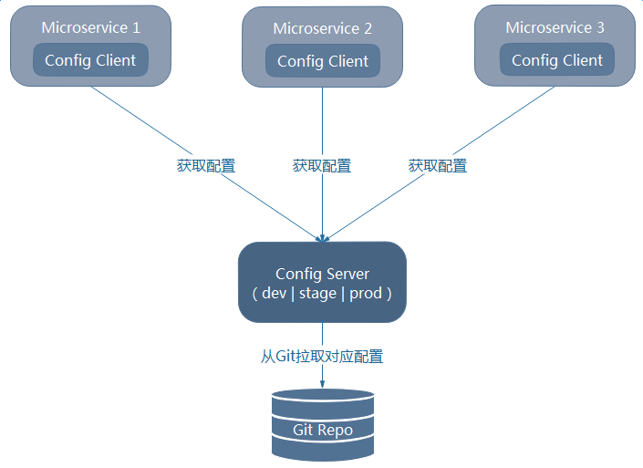
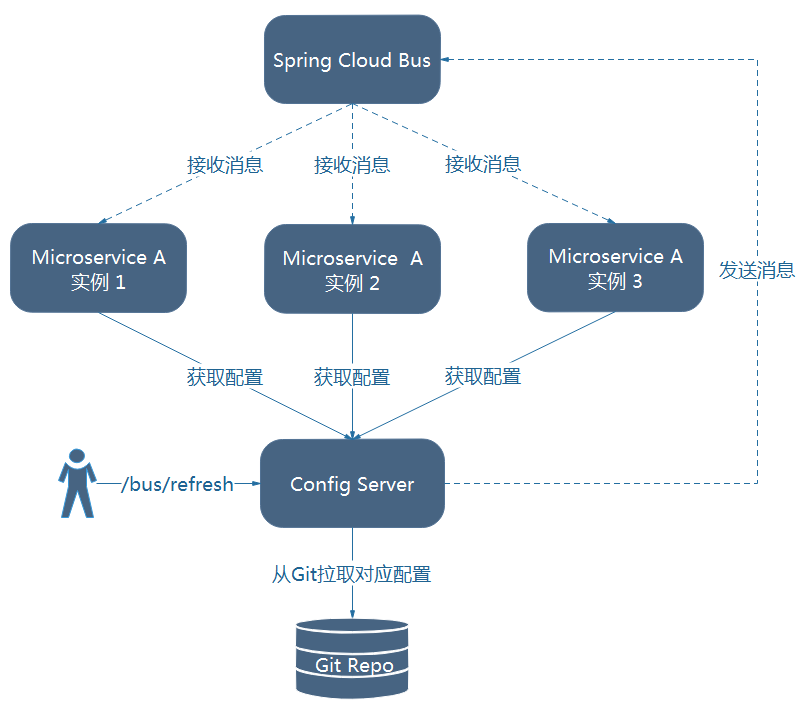
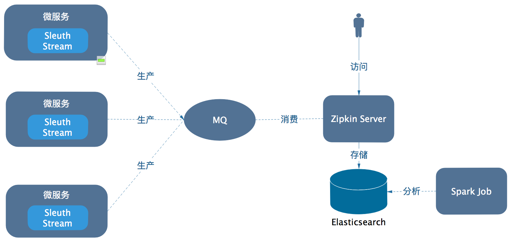
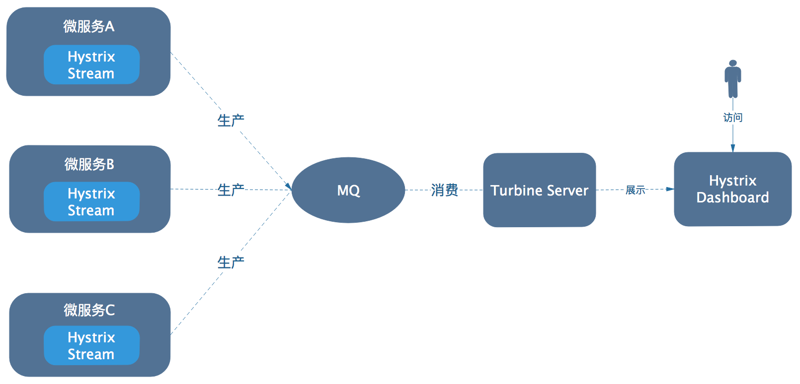

# 组件关系与架构图

## Config Server与X

### 获取配置

如图，微服务集成Config Client，从而与Config Server进行通信，Config Server响应Config Client的请求，去Git仓库（当然也可以是SVN/Vauld/本地存储）获取配置文件，并返回给Config Client。

### 配置刷新

如图，每个微服务都整合 `Spring Cloud Bus` （ `spring-cloud-starter-bus-kafka` ），当配置发生变化，需要刷新时，只需发送POST请求Config Server或任意微服务的`/bus/refresh` 端点，即可实现配置的刷新。

**注意：**

* 可使用`/bus/refresh?destination=ApplicationContext ID` 的方式实现局部刷新（可精确到某个微服务的某个实例）
* ApplicationContext ID详见：<http://www.itmuch.com/spring-cloud-code-read/spring-cloud-code-read-spring-cloud-bus/>
* 必须为微服务的每个实例配置不同的`spring.application.index` ，否则，如果相同微服务n个实例的index相同，那么这n个实例只有1个实例的配置能被成功刷新，在Spring Cloud YES中，将其配置为 `${random.long}` 。

## Eureka Server与X

本图来自Eureka官方，如图：

* Eureka Client与Eureka Server之间：每个微服务集成Eureka Client，从而与Eureka Server进行通信。微服务定期发送心跳，表明自己“活着”，如果Eureka Server长时间（默认3个心跳周期，大约90秒）接收不到某个微服务实例的心跳，就会从Eureka Server的服务注册表（也就是Eureka Server首页显示有哪些微服务那部分）中删除。
* Eureka Server之间：通过相互增量复制的方式，从而实现高可用。（可以把Eureka Server当作是Eureka Server + Eureka Client，因为每个Eureka Server本身也集成了Eureka Client，从而与其他Eureka Server实例通信，并将自己注册到其他Eureka Server实例上）。

**注意：**

* Eureka Server有个自我保护模式。当进入自我保护模式时，Eureka Server不会**主动**删除任何数据——即使某个服务N久不发送心跳给Eureka Server。详见：<http://www.itmuch.com/spring-cloud-sum/understanding-eureka-self-preservation/> 

## Zipkin Server与X

有多种方式与Zipkin Server整合，例如：各个微服务直连Zipkin Server等。考虑到生产环境的负载，Spring Cloud YES采用 `Stream` 的方式，架构如图：

如图，每个微服务都集成Sleuth Stream（ `spring-cloud-sleuth-stream` ），当服务被调用产生调用链数据时，Sleuth Stream将会产生监控数据，并将其发送到MQ（Kafka/RabbitMQ），`Zipkin Server` 消费MQ中的数据，并将数据存储到Elasticsearch中（当然，也可存储到Cassandra、MySQL或内存中）。最后，如需使用Zipkin分析出微服务之间的依赖关系，可借助Zipkin官方提供的Spark Job，它可分析存储在Elasticsearch中的数据，并产生可视化的图表。

## Turbine Server与X

有多种方式与Turbine Server整合，例如基于HTTP的方式等。考虑到生产环境的负载，Spring Cloud YES采用`Stream` 的方式，架构如图：

如图，每个微服务都集成了Hystrix Stream（ `spring-cloud-netflix-hystrix-stream` ），当调用开启Hystrix的API时（例如某个添加了`@HystrixCommand` 注解的API），Hystrix Stream将会产生监控数据，并将其发送到MQ（Kafka/RabbitMQ），`Turbine Server` 消费MQ中的数据。当技术人员需要查看Hystrix监控情况时，可通过Hystrix Dashboard去访问Turbine Server的数据，并展示图表。

**注意：**

* 当且仅当开启了Hystrix的API被调用时，才可能产生监控数据，Turbine才可能接收到数据，Dashboard才可能展示出图表。
* 对于`Spring Cloud Dalston` 及更高版本，默认情况下Feign是不开启Hystrix的。必须设置`feign.hystrix.enabled = true` ，Feign才会开启Hystrix。

## Zuul Server与X

在Spring Cloud YES中，Zuul Server已整合了Hystrix Stream、Sleuth Stream、Eureka Client、Config Client。因此，Zuul与X之间的关系，可详见上文。

Zuul是一个轻量级的API Gateway，因此，Zuul与各业务微服务之间的关系、Zuul能干哪些活儿等内容就不废话了。自行百度吧。