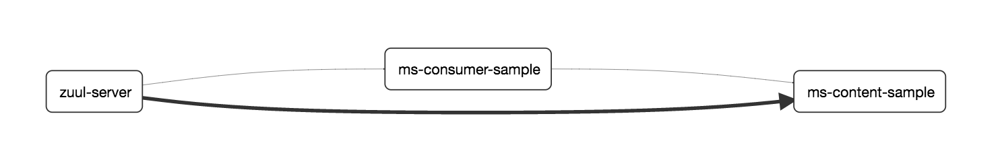

# Zipkin依赖关系图

Spring Cloud YES使用Elasticsearch作为后端存储。

当ElasticSearch作为Zipkin Server的后端存储时，默认不会展示微服务的依赖关系图。如需分析微服务之间的依赖关系，需借助`zipkin-dependencies` （<https://github.com/openzipkin/zipkin-dependencies> ）组件。该工具本质上是一个Spark job，可帮助我们分析微服务之间的依赖关系。

下面我们探讨如何使用`zipkin-dependencies` 。

## 一、快速入门

使用`zipkin-dependencies` 非常简单，只需按照以下步骤即可：

- 下载zipkin-dependencies：

  ```shell
  wget -O zipkin-dependencies.jar 'https://search.maven.org/remote_content?g=io.zipkin.dependencies&a=zipkin-dependencies&v=LATEST'
  ```

- 执行以下命令启动zipkin-dependencies：

  ```shell
  STORAGE_TYPE=elasticsearch ES_HOSTS=localhost:9200 java -jar zipkin-dependencies.jar
  ```

- 再次点击Zipkin Server导航栏上的Dependencies按钮，即可看到类似下图的界面。

  


## 二、指定分析时间

默认情况下，zipkin-dependencies将会分析UTC时间0点后的数据，我们也可通过`YYYY-mm-dd` 格式的参数来指定想要分析的日期。示例：

```shell
# 分析昨天的数据(OS/X下的命令)
STORAGE_TYPE=cassandra java -jar zipkin-dependencies.jar `date -uv-1d +%F`
# 分析昨天的数据(Linux下的命令)
STORAGE_TYPE=cassandra java -jar zipkin-dependencies.jar `date -u -d '1 day ago' +%F`
# 分析指定日期的数据
STORAGE_TYPE=elasticsearch ES_HOSTS=localhost:9200 java -jar zipkin-dependencies.jar 2017-06-28
```


## 三、环境变量

在启动zipkin-dependencies时，我们使用了STORAGE_TYPE、ES_HOSTS两个环境变量。除此以外，还有其他环境变量，这里挑选几个常用的环境变量进行讲解：

- `ES_INDEX`：生成每日索引名称时使用的索引前缀。 默认为"zipkin"。
- `ES_DATE_SEPARATOR`：在索引中生成日期时使用的分隔符。默认为' - '，所以查询的索引看起来像zipkin-yyyy-DD-mm，可以改为“.”，这样查询索引就变成zipkin-yyyy.MM.dd。示例：`ES_DATE_SEPARATOR=.` 。
- `ES_HOSTS`：ElasticSearch主机列表，多个主机使用逗号分隔。 默认为localhost， 如ElasticSearch使用的不是9200端口，则需添加端口部分。尽管多个主机只需一个可用，就能获取ElasticSearch集群中的其余节点，但一般建议将该配置其设置为ElasticSearch集群的所有主节点。示例：`ES_HOSTS=host1,host2:9201` 。
- `ES_NODES_WAN_ONLY`：如设为true，则表示仅使用ES_HOSTS所设置的值，默认为false。当ElasticSearch集群运行在Docker中时，可将该环境变量设为true。 

同理，在使用Cassandra或者MySQL作为后端存储时，也可使借助zipkin-dependencies帮助我们分析微服务的依赖关系图。笔者在此不作赘述，有兴趣的读者朋友可参考：<https://github.com/openzipkin/zipkin-dependencies> 拓展阅读。