# Jenkins

## 一、下载

前往<https://jenkins.io/download/> ，下载适合版本的Jenkins。如用作生产，建议下载`Long-term Support (LTS)` 版本，这样能够获得相对长期的维护；如想体验最新的功能，可尝试下载`Weekly` 版本。本文以基于当前最新的`LTS` 版本 `2.89.2` 。

可以直接下载对应系统下的版本，也可下载`Generic Java package (.war)` ，本文下载的是`Generic Java package (.war)` 。


## 二、安装

安装Jenkins非常简单，只需准备一个Tomcat，然后将下载下来的`jenkins.war` 丢到Tomcat的webapps目录，然后启动Tomcat即可，本文中，Tomcat所使用的端口是`18080` 。

稍等片刻后，访问<http://localhost:1080/jenkins> ，即可看到类似如下的界面：

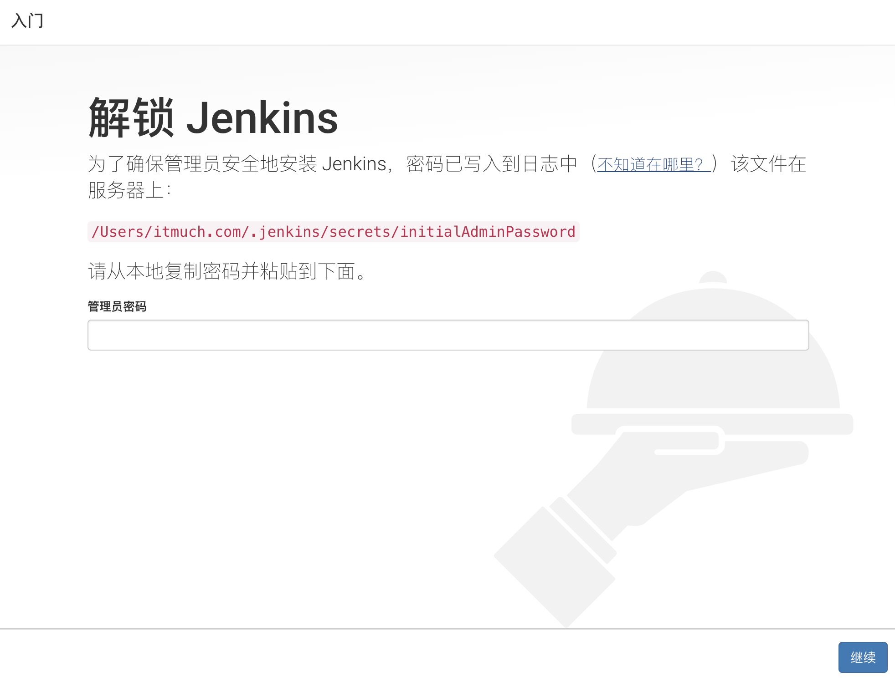

由界面提示可知，Jenkins默认设置了一个初始的管理员密码，该密码存储在``/Users/apple/.jenkins/secrets/initialAdminPassword` 文件中。那么我们可找到这个文件，并打开该文件，将其内容复制到图示的输入框中，并点击`Continue` 。将会出现类似如下的界面：

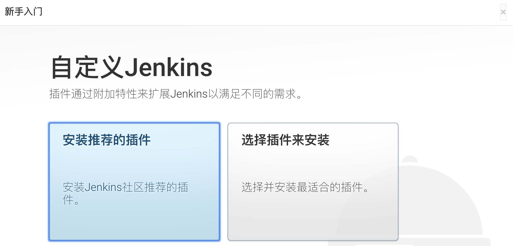

按照你的需求，选择安装推荐的插件，或者自行选择插件安装。这里，笔者选择`Install suggested plugins` 。于是，Jenkins将会根据你的选择，下载对应的插件并安装，如下图所示：

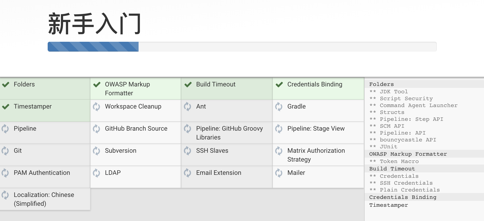

等待一段时间（等待的时间长短视您的网络而定），插件就会安装完成。

安装完插件后，将会看到类似如下的界面：

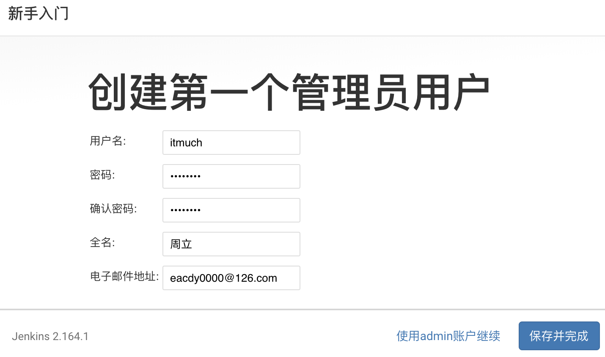

Jenkins要求我们创建第一个管理员账户。填入相关信息，并点击`Save and Finish` 按钮，Jenkins即可安装完成，此时将可看到类似如下的界面——说明Jenkins已经成功安装！

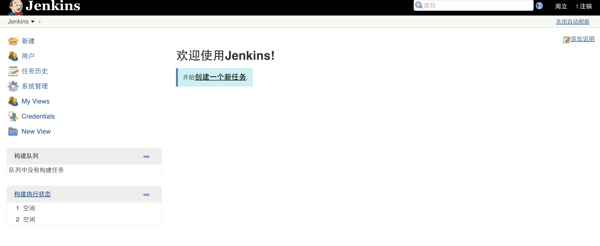


## 三、配置

下面，我们来配置Jenkins。

### 3.1 全局工具配置

1. 点击`系统管理` - `全局工具配置` ，如下图：

   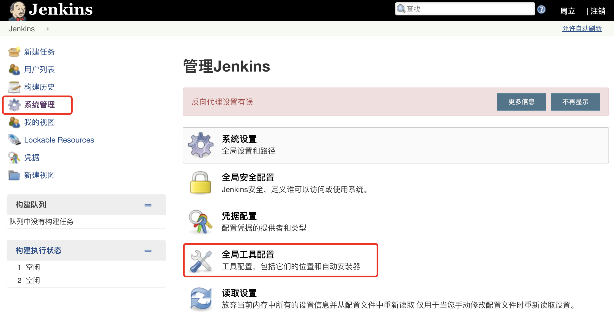

2. 将会看到类似如下图的界面。按需添加**JDK**、**Git**、**Gradle**、**Maven**、**Docker**等配置。配置比较简单，这里就不赘述了。

   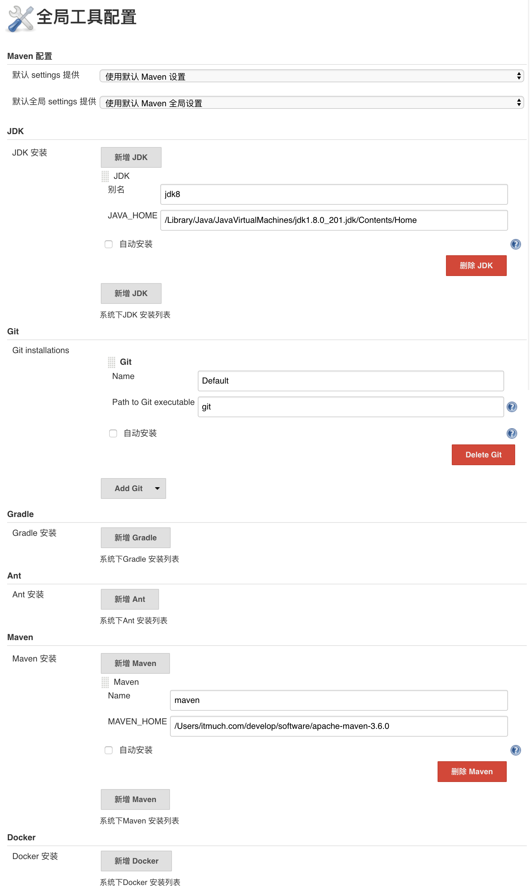

   ​

### 3.2 邮件配置

1. 点击`系统管理` - `系统设置` 

2. 配置管理员邮件地址：

   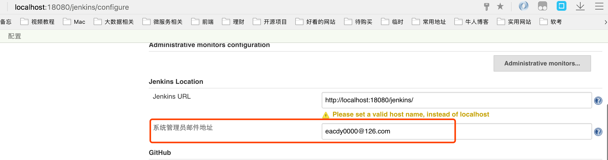

3. 邮件发送配置：

   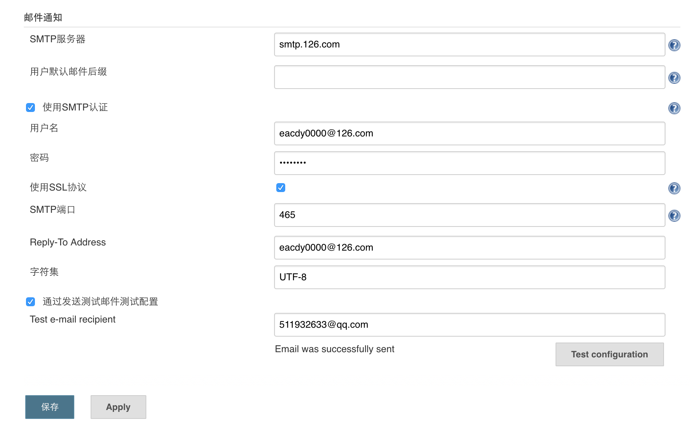

   **需要注意的是：邮件通知所使用的地址必须与管理员邮箱地址一致，否则将无法正常发送邮件！！**

当然，Jenkins还有很多其他的配置选项，读者可自行在Jenkins**左侧的`系统管理` 自行挖掘**。


## 四、使用案例1：构建项目

1. 在Jenkins首页，点击`开始创建一个新任务.` ，如下图所示：

   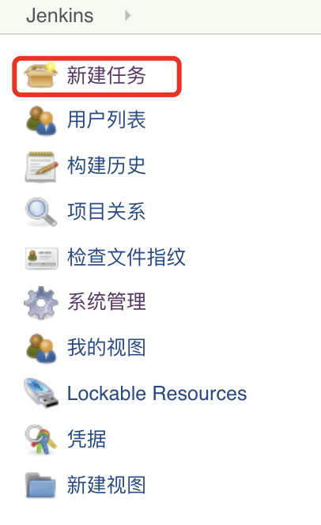

2. 创建一个自由风格的项目，如下图所示：

   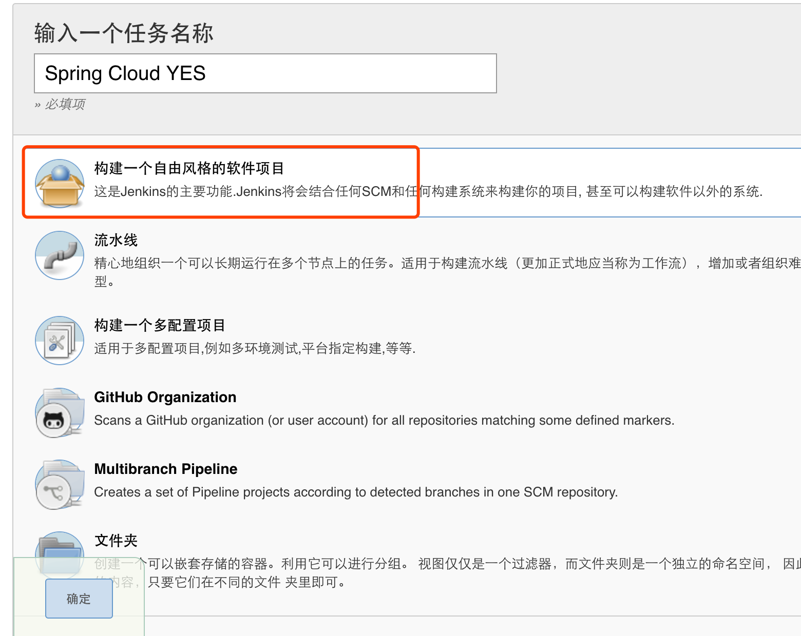

3. 点击确定后，将会看到配置详情：

   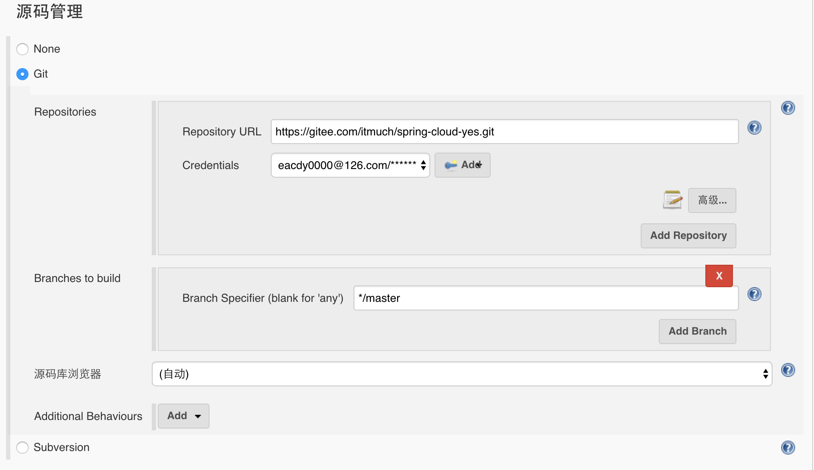

   如图，请设置您想构建的项目的Git仓库地址、对应的账号密码、想要构建的Git分支。一般来说，源码库浏览器选择自动即可。

4. Maven配置

   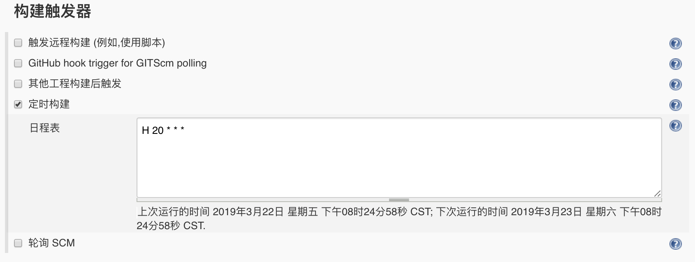

   其中的`maven-3.5.0` ，是之前在`全局工具配置` 章节中的Maven配置名称。

5. 如果想设置定时构建（例如：每天晚上八点构建）：

   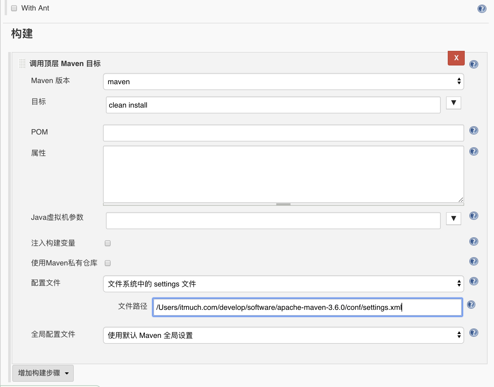

6. 配置构建完成后操作（以发送邮件为例）

   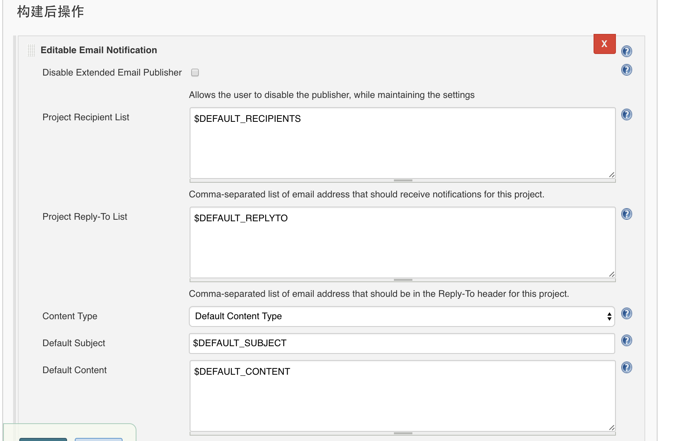

7. 点击构建项目，执行构建

   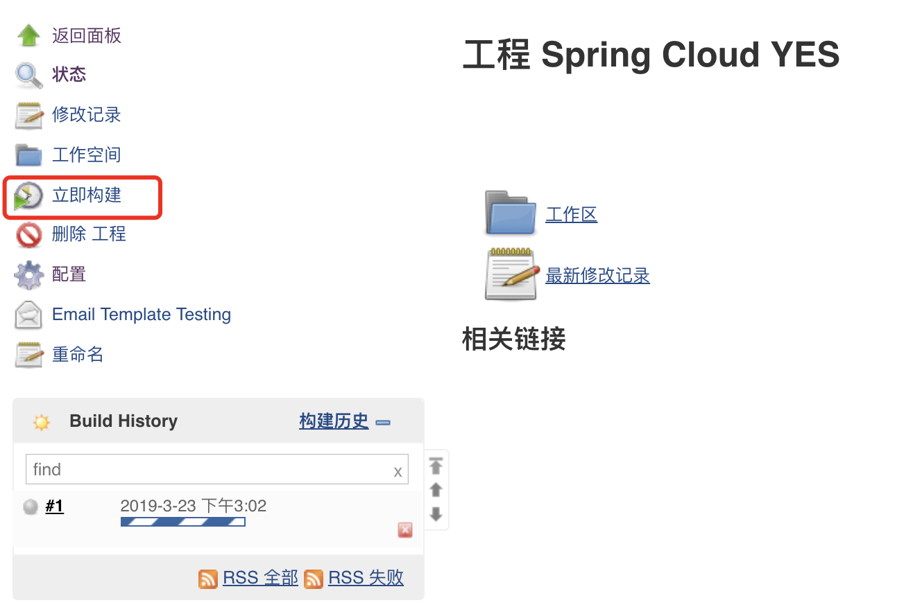


## 五、使用案例：流水线

`Jenkins 2.x` 默认就已提供了强大的流水线功能。

1. 创建一个流水线类型的任务

2. 填写Pipeline脚本：

   ```groovy
   node {
      def mvnHome
      stage('Preparation') { // for display purposes
         // clone源码
         git 'https://gitee.com/itmuch/spring-cloud-yes.git'
         // 这里的maven-3.5.0必须跟全局工具配置中设置的Maven名称一致       
         mvnHome = tool 'maven-3.5.0'
      }
      stage('Build') {
         // Run the maven build
         if (isUnix()) {
            sh "'${mvnHome}/bin/mvn' clean install"
         } else {
            bat(/"${mvnHome}\bin\mvn" clean install/)
         }
      }
      stage('Email') {
         mail bcc: '', body: '构建成功。', cc: '511932633@qq.com', from: 'eacdy0000@126.com', replyTo: '', subject: '构建成功', to: 'eacdy0000@126.com'
      }
   }
   ```

   如代码所示，我们编写了一个流水线，该流水线包含三个阶段：

   * Preparation：在该阶段中，我们Clone源码，同时，定义了一个变量叫mvnHome。
   * Build：在该阶段中，我们执行`mvn clean install` 命令，其中我们对操作系统做了判断。
   * Email：如果构建成功，就发送邮件到`511932633@qq.com` 

3. Pipeline脚本功能非常强大，默认支持数十个指令！如果想了解Pipeline的语法，可点击下图中的`Pipeline Syntax` 按钮。

   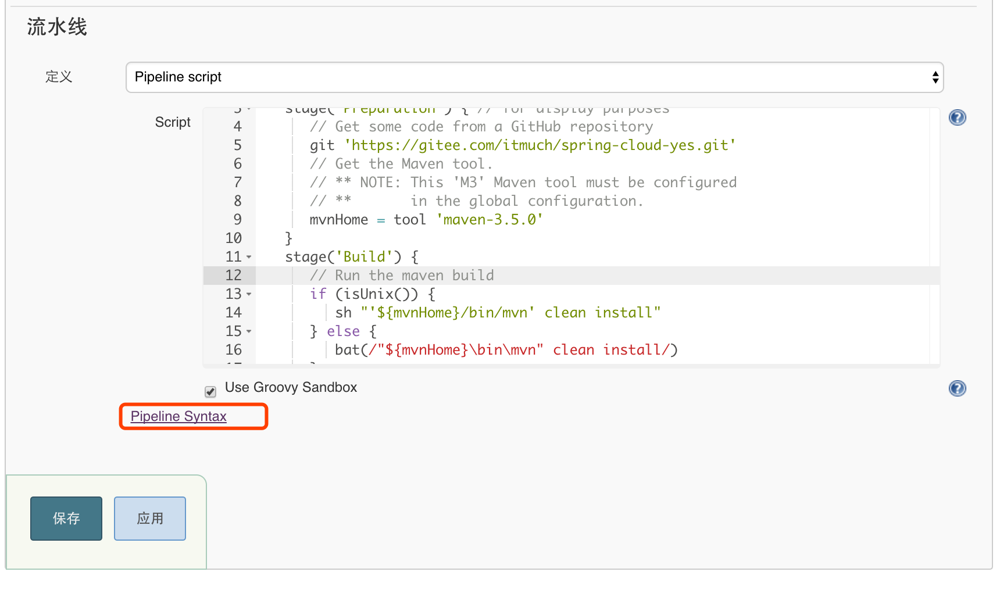

   ​