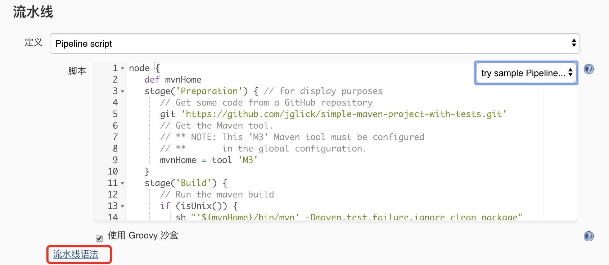

# Jenkins

> 本文基于当前最新的 `LTS` 版本 `2.164.1` ，理论上适应于Jenkins 2.x所有版本。

## 一、下载

前往<https://jenkins.io/download/> ，按需下载。如用于生产，建议下载`Long-term Support (LTS)` 版本，这样能够获得相对长期的维护；如想体验最新的功能，可尝试 `Weekly` 版本。

可以直接下载特定系统专属的版本，也可下载 `Generic Java package (.war)`  。本文下载的是 `Generic Java package (.war)` ，这样对所有系统都通用。


## 二、安装

### 2.1 通用安装方式

安装Jenkins非常简单，只需准备一个Tomcat（笔者使用的是Tomcat 8），然后将下载下来的 `jenkins.war` 丢到Tomcat的 `webapps` 目录中，然后启动Tomcat即可。本文，Tomcat使用的端口是 `18080` 。

> Tomcat下载与安装本文不做赘述，请自行百度。

### 2.2 Docker安装方式

笔者已为大家准备好 `docker-compose` 脚本，只需在 `项目根目录/docker` 目录下执行`docker-compose up jenkins` 即可安装Jenkins。

如果不想使用笔者提供的脚本，可使用如下命令安装Jenkins：

```shell
docker run -d -v jenkins_home:/var/jenkins_home -p 18080:8080 -p 50000:50000 jenkins/jenkins:lts
```

### 2.3 初始化

Jenkins启动片刻后，访问 `http://localhost:18080/jenkins` ，即可看到类似如下的界面：


由界面提示可知，Jenkins设置了一个初始的管理员密码，该密码存储在 `/Users/itmuch.com/.jenkins/secrets/initialAdminPassword`  文件中——只需可找到该文件，将其内容复制到图示的输入框中即可。点击 `继续` 按钮，将会出现类似如下的界面：


按需选择即可，建议初学者选择 `安装推荐的插件` ，因为该选项包含了Jenkins常用的一些插件，基本满足日常使用；高手则可选择 `选择插件来安装` ，该选项更具灵活性。这里，笔者以 `安装推荐的插件` 为例，点击后，将会看到类似如下的界面：


待插件安装完毕后（等待的时间长短视您的网络而定），将会看到类似如下的界面：


Jenkins要求我们创建第一个管理员账户。填入相关信息，并点击 `保存并完成` 按钮，Jenkins即可初始化完成。

> **TIPS**
>
> 安装完成后，如果访问 `http://localhost:18080/jenkins` 变成白板，而且没有反应，建议重启Jenkins服务器，并重新访问尝试。


## 三、配置

下面，我们来配置Jenkins。

### 3.1 全局工具配置

1. 点击`系统管理` - `全局工具配置` ，如下图：

   

2. 将会看到类似如下图的界面。按需添加**JDK**、**Git**、**Gradle**、**Maven**、**Docker**等配置。配置比较简单，这里就不赘述了。

   


### 3.2 邮件配置

1. 点击 `系统管理` - `系统设置` 

2. 配置管理员邮件地址：

   

3. 邮件发送配置：

   

   **需要注意的是：邮件通知所使用的地址必须与管理员邮箱地址一致，否则将无法正常发送邮件！！**

当然，Jenkins还有很多其他的配置选项，读者可自行在Jenkins**左侧的`系统管理` 自行挖掘**。


## 四、使用案例1：构建项目

1. 在Jenkins首页，点击`开始创建一个新任务.` ，如下图所示：

   

2. 创建一个自由风格的项目，如下图所示：

   

3. 点击确定后，将会看到配置详情：

   

   如图，请设置您想构建的项目的Git仓库地址、对应的账号密码、想要构建的Git分支。一般来说，源码库浏览器选择自动即可。

4. Maven配置

   

   其中`Maven版本` 中所选择的 `maven` ，就是之前在`全局工具配置` 一节中的Maven配置名称。

5. 如果想设置定时构建（例如：每天晚上八点构建）：

   

6. 配置构建完成后操作（以发送邮件为例）

   

7. 点击构建项目，执行构建

   


## 五、使用案例2：流水线

`Jenkins 2.x` 内置了强大的流水线功能。

1. 创建一个 `流水线` 类型的任务

2. 填写Pipeline脚本：

   ```groovy
   node {
      def mvnHome
      stage('Preparation') { // for display purposes
         // clone源码
         git 'https://gitee.com/itmuch/spring-cloud-yes.git'
         // 这里的maven-3.5.0必须跟全局工具配置中设置的Maven名称一致       
         mvnHome = tool 'maven-3.5.0'
      }
      stage('Build') {
         // Run the maven build
         if (isUnix()) {
            sh "'${mvnHome}/bin/mvn' clean install"
         } else {
            bat(/"${mvnHome}\bin\mvn" clean install/)
         }
      }
      stage('Email') {
         mail bcc: '', body: '构建成功。', cc: '511932633@qq.com', from: 'eacdy0000@126.com', replyTo: '', subject: '构建成功', to: 'eacdy0000@126.com'
      }
   }
   ```

   如代码所示，我们编写了一个流水线，该流水线包含三个阶段：

   * Preparation：在该阶段中，我们Clone源码，同时，定义了一个变量叫mvnHome。
   * Build：在该阶段中，我们执行 `mvn clean install` 命令，其中针对操作系统做了判断。
   * Email：如果构建成功，就发送邮件到 `511932633@qq.com` 。

3. Pipeline脚本功能非常强大，默认支持数十个指令！你可能担心指令学习的成本，但这种担心其实是多余的——只需点击下图中的 `流水线语法` 按钮，**就可以傻瓜化地使用Pipeline语法啦**！

   

   