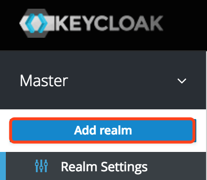
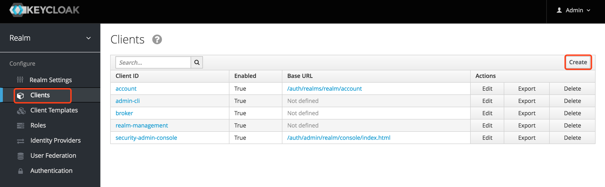
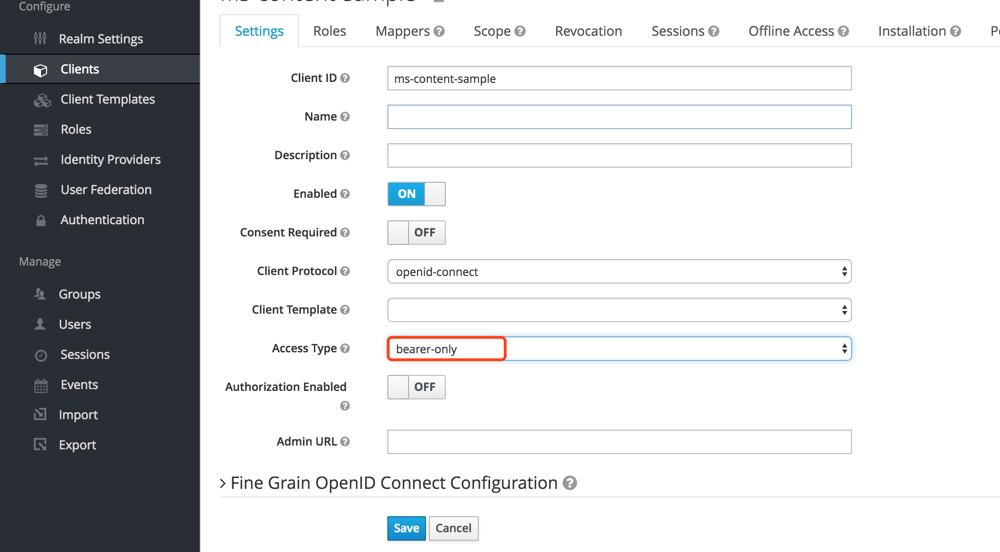
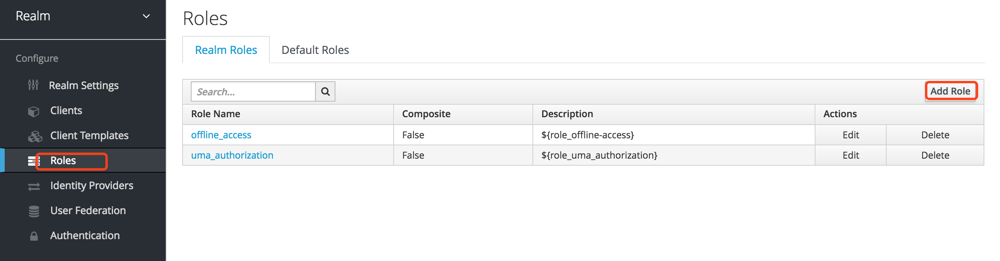
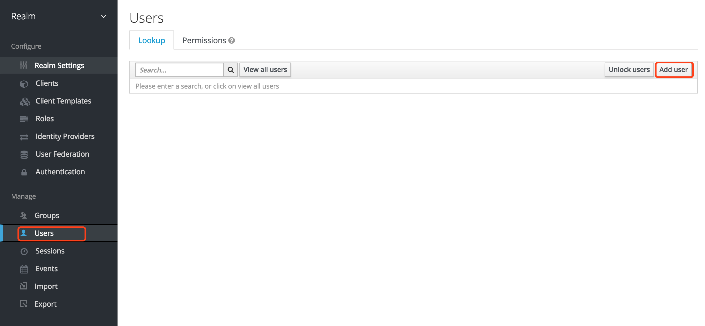
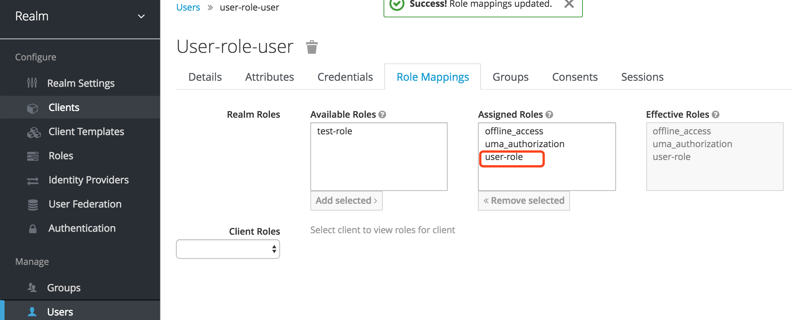

# Keycloak初始化

## 手动初始化

### 添加Realm

点击如下图的按钮，并按照提示操作，创建一个名为`realm` 的Realm。

### 添加Client

#### 为`ms-content-sample` 服务添加Client

点击如下图的按钮，并按照提示操作，为`ms-content-sample` 添加Client：

填入名称`ms-content-sample` ：

设置`ms-content-sample` 这个Client，如下图：

由于在Spring Cloud中，一般流量都是经过Zuul的，所以Zuul后端的微服务只需要使用`bearer-only` 这种Access Type就OK了。

#### 为`ms-consumer-sample` 服务添加Client

类似地，我们为`ms-consumer-sample` 服务也添加一个Client。

#### 为`zuul-server` 服务添加Client

`zuul-server` 服务的Client配置如下：

如图，我们为Zuul配置的Access Type类型是`public` 。这样，当用户访问Zuul上需要认证/授权的页面时，就会跳转到Keycloak登录页面。

### 添加角色

如下图，点击`Add Role` 按钮，创建两个角色：

* `user-role`
* `test-role` 

### 添加用户

点击如下图的按钮，创建两个用户：

* `user-role-user`
* `test-role-user`

### 分配角色

分别为用户分配角色：

* 为`user-role-user` 用户分配`user-role`
* 为`test-role-user` 用户分配`test-role` 

## 自动初始化

导入本文档目录下的json文件到Keycloak即可完成自动初始化。

## 测试

* 使用`user-role-user` 及其密码访问`http://localhost:5566/ms-consumer-sample/articles` 可正常访问
* 使用`test-role-user` 及其密码访问`http://localhost:5566/ms-consumer-sample/articles` 会报403