# Keycloak

## 安装&初始化

### 下载

只需前往 <http://www.keycloak.org/downloads.html> ，按需进行下载。

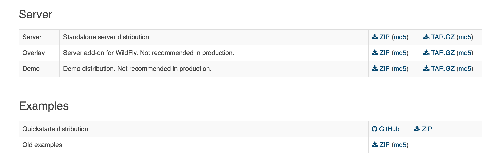

笔者下载的是“Standalone server distribution” 。


### 安装&启动

安装Keycloak非常简单，步骤如下：

* 解压下载下来的安装包
* 将目录切换到`KEYCLOAK_PATH/bin` ，其中KEYCLOAK_PATH是您Keycloak的根目录
* 执行`./standalone.sh` ，即可启动Keycloak，如需后台运行，则执行`./standalone.sh &` 。


### 初始化

启动后，访问<http://localhost:8080/> 将会显示类似如图的界面：


该界面让我们创建一个初始化的admin账户。那么我们不妨填写一下，为了测试方便，我们将账号/密码分别设为`admin/admin` ，然后点击create按钮，将会跳转到如下界面：


由图可知，管理员账户已创建成功，Keycloak初始化也已完成。


### 管理控制台

点击上图的`Administration Console` 按钮，将会弹出登录页面：

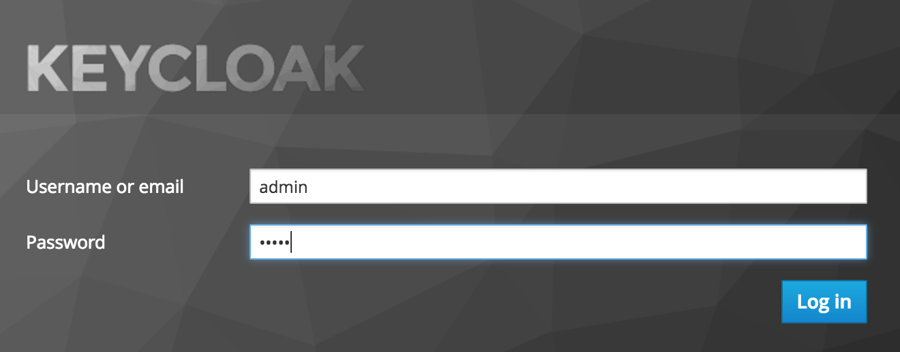

输入我们之前初始化设置的账号、密码，并点击`Login in` 按钮，即可登录管理控制台，如下图所示：


由图可知，管理控制台的菜单挺多的，功能也比较丰富，不禁让人有点恐惧——这么多菜单，这么多子功能项，得花多少时间研究啊！没有关系，可以随着笔者的节奏，逐步深入。


## 与Spring Boot整合

纳尼？上一篇才讲了个初始化，这一篇就与Spring Boot整合啦？这是什么节奏？按照套路，不应该先介绍下这个术语，那个概念吗？

没有关系，Keycloak非常简单，我们可以在实战中了解各种概念。

整合Keycloak非常简单，因为Keycloak为我们提供了各种语言、各种框架的 `Adapter` ，基于OpenID/SAML协议的Adapter，大概二十多个，有兴趣的可前往：<http://www.keycloak.org/docs/latest/securing_apps/index.html#openid-connect-3> 阅读。后面等笔者有空了，也会将这些文章翻译出来，敬请期待。

在这里，我们选择OpenID协议中的`Spring Boot Adapter` ，相关文档：<http://www.keycloak.org/docs/latest/securing_apps/index.html#_spring_boot_adapter> ，当然，如果你对Spring Security比较熟悉，也可以选用<http://www.keycloak.org/docs/latest/securing_apps/index.html#_spring_security_adapter> 。不过笔者认为Spring Security过于复杂，用Spring Boot Adapter已经能够完成我们的需求，所以就不搞Spring Security Adapter了。

### 微服务

假设有一个Spring Boot微服务：

* 名为：`ms-content-sample` 
* 首页是<http://localhost:8081>
* 它有个路径<http://localhost:8081/articles> ，只有`user-role` 角色的用户才能访问，`test-role` 角色的用户不允许访问。


下面我们来为该服务整合Keycloak，并逐步实现基于Keycloak的单点认证及授权。


### 准备工作

#### 创建Realm

* 首先，我们需要创建一个Realm。Realm是一个隔离的概念，Realm A中的用户与Realm B中的用户完全隔离。当然，也可以不创建Realm，直接用 `Master` 这个Realm，不过一般来说，为了资源的隔离，以及更好的安全性不太建议与管理员共用Realm。如下图所示：


* 输入Realm名称，这里，如图所示，我们创建了一个名为`realm` 的Realm。

  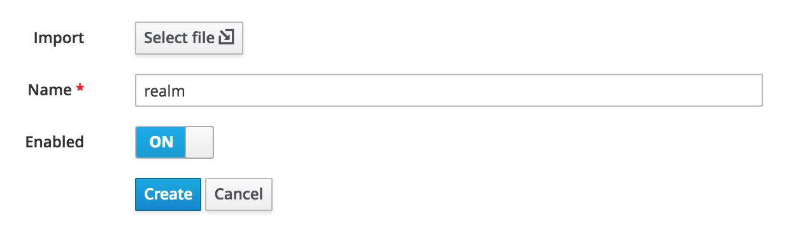

#### 创建Client

* 创建完realm后，我们来为`ms-content-sample` 创建`Client` ，点击下图的Create按钮。

  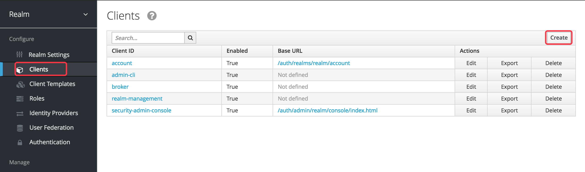


* 填写Client信息，这边我们创建一个名为`ms-content-sample` 的Client。

  

#### 设置Client

* 下面我们来配置Client，点击途中的Edit按钮：

  

* 设置Client

  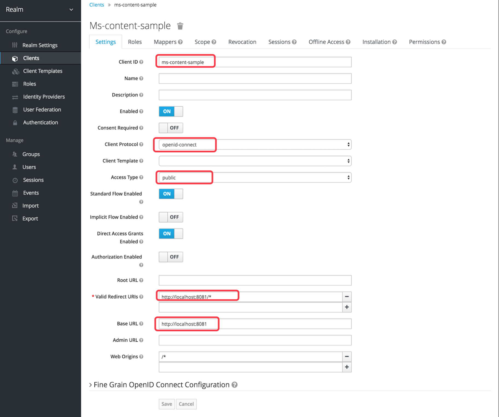

  如图，我们配置了Access Type为public，当然还有其他选项，例如bearer-only，我们先选public，bearer-only我们后面会细讲；配置了Valid Redirect URLS，这是认证成功后跳转到的页面地址，其中我们使用了通配符；配置了Base URL，一般配置成微服务首页即可。


#### 创建角色

比较简单，如图，我们创建了两个角色，`user-role` 以及`test-role` 。

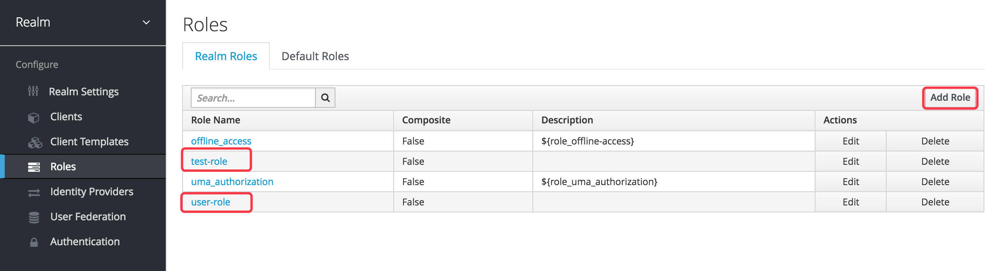


#### 创建用户并分配角色

* 创建用户

  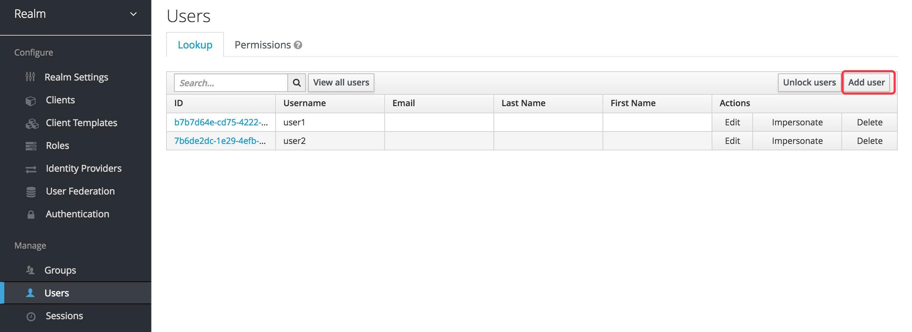

* 分配角色

  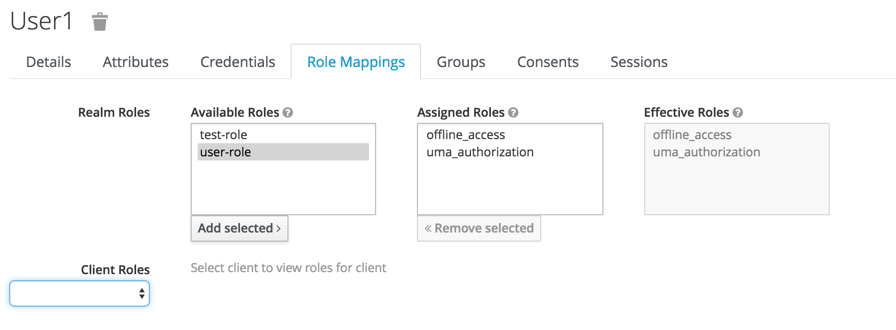

  如图，点击user-role，并点击Add selected，即可为user1用户分配user-role角色；同理，为user2用户分配test-role角色。

#### 为用户设置登录密码


### 为Spring Boot微服务整合Keycloak


话不多说，上代码——

基于Spring Boot Adapter的整合步骤如下：

* 添加依赖管理，引入Keycloak adapter的bom：

  ```xml
  <dependencyManagement>
    <dependencies>
      <dependency>
        <groupId>org.keycloak.bom</groupId>
        <artifactId>keycloak-adapter-bom</artifactId>
        <version>3.4.0.Final</version>
        <type>pom</type>
        <scope>import</scope>
      </dependency>
    </dependencies>
  </dependencyManagement>
  ```

* 添加Keycloak的starter：

  ```xml
  <dependency>
    <groupId>org.keycloak</groupId>
    <artifactId>keycloak-spring-boot-starter</artifactId>
  </dependency>
  ```

* 在`application.yml` 中添加如下配置：

  ```yaml
  keycloak:
    # 表示是一个public的client
    public-client: true
    # keycloak的地址
    auth-server-url: http://localhost:8080/auth
    # keycloak中的realm
    realm: realm
    resource: ms-content-sample
    securityConstraints:
    - authRoles:
      # 以下路径需要user-role角色才能访问
      - user-role
      securityCollections:
      # name可以随便写
      - name: user-role-mappings
        patterns:
        - /articles
  ```

  配置项解释详见注释。
* 这样就整合好Keycloak了。


### 测试

访问<http://localhost:8081/articles> ，使用`user1` 账号登录，发现可以访问；使用`user2` 账号登录，则会弹出如下界面：

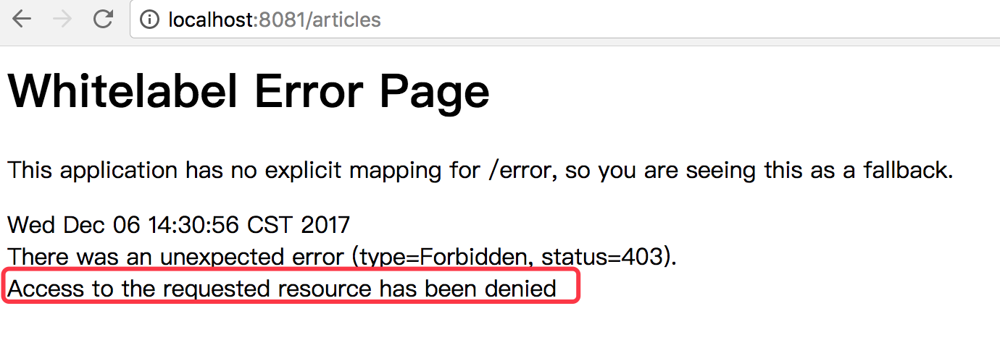

至此，我们已经为Spring Boot应用整合了Keycloak，并且实现了 `RBAC` 模型的权限控制。


### 在方法中获得身份、角色等信息

很多场景下，我们希望在Controller中获得当前用户的主体信息，例如获取当前登录的用户名、角色等信息。此时该怎么办呢？

只需添加如下代码：

```java
@GetMapping("/articles")
public HashMap<Object, Object> search(Principal principal) {
    if (principal instanceof KeycloakPrincipal) {
        AccessToken accessToken = ((KeycloakPrincipal) principal).getKeycloakSecurityContext().getToken();
        String preferredUsername = accessToken.getPreferredUsername();
        AccessToken.Access realmAccess = accessToken.getRealmAccess();
        Set<String> roles = realmAccess.getRoles();
        log.info("当前登录用户：{}, 角色：{}", preferredUsername, roles);
    }
```

这样，当该方法被请求时，就会打印类似如下的日志：

> 2017-12-06 14:51:50.963  INFO 3160 --- [nio-8081-exec-3] c.i.yes.controller.ArticleController     : 当前登录用户：user1, 角色：[user-role, uma_authorization]

是不是非常简单呢？


## 与Spring Cloud整合

经过上文的讲解，我们已实现Keycloak整合Spring Boot应用。那么，在一个使用Spring Cloud构建的分布式应用中，要如何整合Keycloak呢？——即：A微服务信任的Token要如何传递给B微服务呢？

下面我们分两种场景：

* 使用Feign传递Token
* 使用Zuul传递Token


### 使用Feign传递Token

下面我们创建一个新的微服务`ms-consumer-sample` ，该微服务使用Feign调用上文的<http://localhost:8081/articles> 接口。

按照前文整合Spring Boot的步骤，在相同Realm中，创建一个新的Client，名为`ms-consumer-sample` ，然后为`ms-consumer-sample` 微服务也整合Keycloak。下面我们使用Feign实现Token的传递：

只需编写一个Feign拦截器：

```java
public class KeycloakRequestInterceptor implements RequestInterceptor {

    private static final String AUTHORIZATION_HEADER = "Authorization";

    @Override
    public void apply(RequestTemplate template) {
        ServletRequestAttributes attributes = (ServletRequestAttributes) RequestContextHolder.getRequestAttributes();
        Principal principal = attributes.getRequest().getUserPrincipal();

        if (principal != null && principal instanceof KeycloakPrincipal) {
            KeycloakSecurityContext keycloakSecurityContext = ((KeycloakPrincipal) principal)
                    .getKeycloakSecurityContext();

            if (keycloakSecurityContext instanceof RefreshableKeycloakSecurityContext) {
                RefreshableKeycloakSecurityContext.class.cast(keycloakSecurityContext)
                        .refreshExpiredToken(true);
                template.header(AUTHORIZATION_HEADER, "Bearer " + keycloakSecurityContext.getTokenString());
            }

        }
        // 否则啥都不干
    }
}
```

由该拦截器代码不难看出，我们把自己接收的Token，放到Header中，传递给服务提供者（即：ms-content-sample） 。

这样，我们就实现了`ms-consumer-sample` 以及`ms-content-sample` 两个微服务之间的Token传递——即：单点登录


### 使用Zuul传递Token

在Spring Cloud构建的应用中，往往使用Zuul作为对外服务的入口，架构图如下：


此时，我们希望达到：在Zuul微服务上达到统一认证的效果——即：在Zuul上登录，就相当于登录了所有微服务。

要怎么办呢？这个问题，其实就是：Zuul信任的Token要如何传递给Zuul所代理的微服务呢？

我们创建一个新的client，名为`zuul-server` ，然后编写一个Zuul过滤器：

```java
@Component
public class KeycloakRouteZuulFilter extends ZuulFilter {

    private static final String AUTHORIZATION_HEADER = "Authorization";

    @Override
    public String filterType() {
        return FilterConstants.ROUTE_TYPE;
    }

    @Override
    public int filterOrder() {
        return 1;
    }

    @Override
    public boolean shouldFilter() {
        RequestContext ctx = RequestContext.getCurrentContext();
        HttpServletRequest request = ctx.getRequest();
        Principal principal = request.getUserPrincipal();
        return principal != null && principal instanceof KeycloakPrincipal;
    }

    @Override
    public Object run() {
        RequestContext ctx = RequestContext.getCurrentContext();
        if (ctx.getRequest().getHeader(AUTHORIZATION_HEADER) == null) {
            this.addKeycloakTokenToHeader(ctx);
        }
        return null;
    }

    private void addKeycloakTokenToHeader(RequestContext ctx) {
        Principal principal = ctx.getRequest()
                .getUserPrincipal();

        // 这里之所以可以直接强制转换，是因为shouldFilter中已经做了类型判断。
        KeycloakSecurityContext keycloakSecurityContext = ((KeycloakPrincipal) principal)
                .getKeycloakSecurityContext();

        if (keycloakSecurityContext instanceof RefreshableKeycloakSecurityContext) {
            ctx.addZuulRequestHeader(AUTHORIZATION_HEADER,
                    this.buildBearerToken(
                            (RefreshableKeycloakSecurityContext) keycloakSecurityContext
                    )
            );
        }
        // 用户没有登录，啥都不干
    }

    private String buildBearerToken(RefreshableKeycloakSecurityContext securityContext) {
        return "Bearer " + securityContext.getTokenString();
    }
}
```

由代码可知，我们在该过滤器中实现了Token的传递。

> 代码详见ms-consumer-sample


### 配置改进

上文，我们创建的Client都是`public` 类型的，而现在，其实只有Zuul需要对外，其他服务都是经过Zuul或者Feign传递Token的。因此，我们可将除Zuul以外的所有Client的Access Type统统改为`bearer-only` ，如图所示：

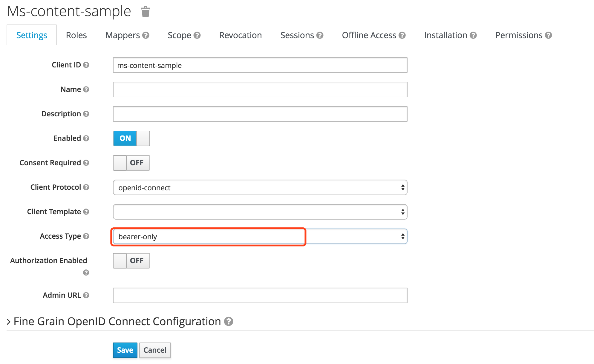

> 代码详见`zuul-server` 。


## 登录相关配置

前文中，我们是自己添加用户的，现实中，用户往往是注册的；另外，如果我想实现`Remember Me` 的功能该怎么办呢？难道这一切都需要自己编码吗？显然不需要！只需按需在下图中配置即可：

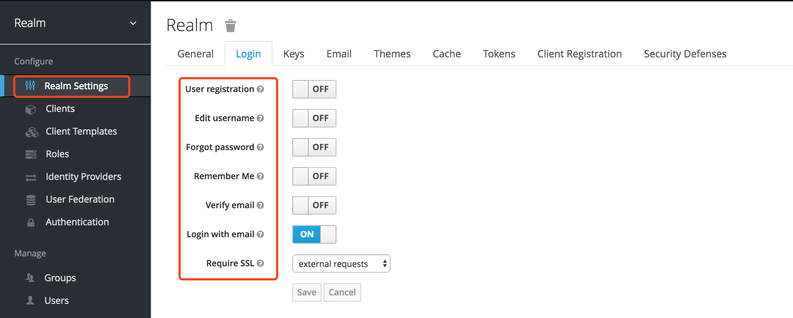

例如，我们想实现用户注册，只需将User registration勾选即可。这样登录页面就会变成类似下图：


## 主题定制

Keycloak自带的届满稍微有那么一点丑陋，但Keycloak允许我们自定义主题——

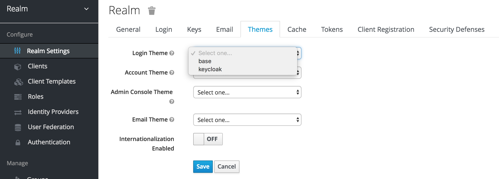

开发好主题后，将主题目录复制到`$KEYCLOAK_PATH/themes` 目录中即可。Keycloak默认为我们准备了两套主题，如下图：


我们可参考这两套主题的代码，编写我们自己的主题。主题定制比较简单，是用Freemarker搞的。万能GitHub上也有一些主题，只需要搜 `keycloak theme` 即可找到。个别主题还是不错的。


## 第三方认证

很多网站有QQ登录、GitHub登录、新浪微博登录等第三方认证按钮。如果我们也想实现第三方认证该怎么办呢？Keycloak也具备这样的能力！下面笔者以GitHub登录为例，为我们的应用实现使用GitHub账号登录的能力！

* 在Keycloak管理控制台上按下图操作：

  

* 将会看到类似如下的界面，在这个页面上，Client ID以及Client Secret是必填项，如何获得这两项的值呢？

  


* 登录GitHub，访问 <https://github.com/settings/profile> ，点击左侧的 [Developer settings](https://github.com/settings/developers) 按钮，将会看到类似如下的界面：

  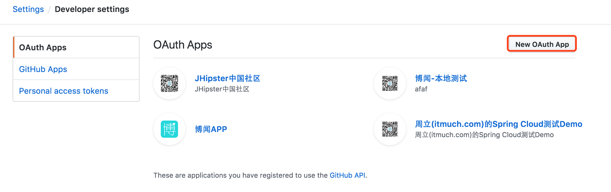

* 点击`New OAuth App` 按钮，将会看到类似于如下的界面：

  

* 点击Register application按钮后，即可看到该应用的Client ID以及Client Secret。

* 回到Keycloak管理控制台，填入获得的Client ID以及Client Secret。

* 下面，我们来为GitHub用户分配角色。点击下图中的Edit按钮：

  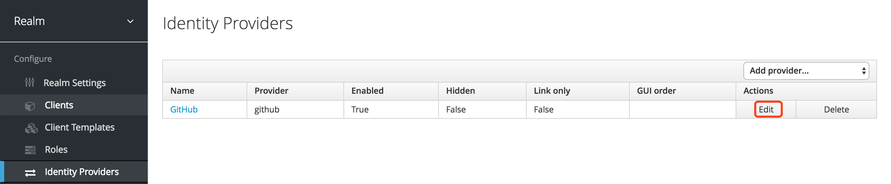

* 将会看到类似如下的界面。点击右侧的Create：

  

* 将会看到类似如下的界面。按照下图填写信息，其中Name随意，建议设置一个人类可读的名称即可。

  


### 测试

* 注销后，重新访问任意一个需要登录的URL，将会看到类似如下的界面：

  
  由图可知，激动人心的GitHub登录按钮已经出现了。

* 访问 <http://zuul/ms-content-sample/articles> ，该地址需要user-role角色才能访问。如果可正常访问。说明配置成功。


## 参考文档

<http://slackspace.de/articles/authentication-with-spring-boot-angularjs-and-keycloak/>