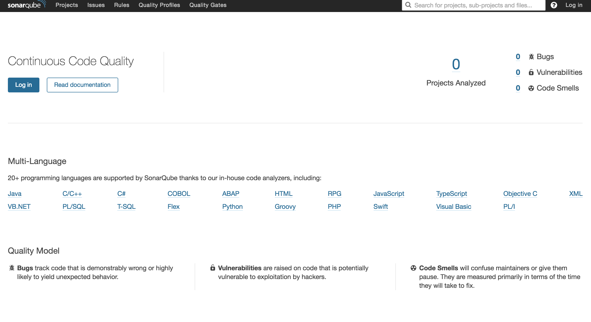

# 安装

SonarQube搭建比较简单，步骤如下：

## 下载

前往<https://www.sonarqube.org/downloads/> 下载合适的版本。建议下载LTS版本，以便获得长期的维护与支持。本文所使用的SonarQube版本是`6.7` 。

下载后解压，备用。


## 安装与启停

* 将目录切换到`$SONARQUBE_HOME/bin` 目录，可看到类似如下的目录结构：

  ```
  ├── bin
  │   ├── jsw-license
  │   ├── linux-x86-32
  │   ├── linux-x86-64
  │   ├── macosx-universal-64
  │   ├── windows-x86-32
  │   └── windows-x86-64
  ```

* 根据你的操作系统，切换到响应目录。例如，您的机器是`CentOS X64` ，则可切换到`linux-x84-64` 目录。

* 执行如下命令

  ```shell
  ./sonar.sh start
  ```

  即可启动SonarQube。当然，该shell还有其他命令，可输入`./sonar.sh --help` 或者`./sonar.sh` 查阅。

* 稍等片刻，访问 <http://localhost:9000> 即可看到类似如下的界面：

  

* 说明Sonar已安装完毕。

* 停止SonarQube，只需执行 `./sonar.sh stop` 即可。

* 重启，只需执行`./sonar.sh restart` 即可。


## 生产可用

上文，我们已经成功安装了SonarQube。但默认情况下，SonarQube使用的是H2数据库，这是一款非常流行的嵌入式数据库。但生产环境中，SonarQube并不建议使用H2。SonarQube支持多种数据库，例如MySQL、Qracle、PostgreSQL等。下面，我们以MySQL为例，让SonarQube使用MySQL。

* 创建一个MySQL数据库，例如`sonar` ，字符集为UTF-8

* 修改配置文件：`$SONARQUBE_HOME/conf/sonar.properties` 。

  找到类似如下的内容：

  ```
  #----- MySQL 5.6 or greater
  # Only InnoDB storage engine is supported (not myISAM).
  # Only the bundled driver is supported. It can not be changed.
  #sonar.jdbc.url=jdbc:mysql://localhost:3306/sonar?useUnicode=true&characterEncoding=utf8&rewriteBatchedStatements=true&useConfigs=maxPerformance&useSSL=false
  ```

  在这行下面添加如下内容，内容根据你的数据库地址、账号、密码自行修改。

  ```properties
  sonar.jdbc.url=jdbc:mysql://localhost:3306/sonar?useUnicode=true&characterEncoding=utf8&rewriteBatchedStatements=true&useConfigs=maxPerformance&useSSL=false
  sonar.jdbc.username=root
  sonar.jdbc.password=123456
  ```

* 执行`./sonar.sh restart` ，重启SonarQube。观察MySQL，可以发现，此时SonarQube将会自动在MySQL数据库中建表并插入初始化数据。

* 类似的方式，你也可以为你的SonarQube配置其他数据库。


## 配置开机自启动

### 新建文件/etc/init.d/sonar，输入如下内容：

```shell
#!/bin/sh
#
# rc file for SonarQube
#
# chkconfig: 345 96 10
# description: SonarQube system (www.sonarsource.org)
#
### BEGIN INIT INFO
# Provides: sonar
# Required-Start: $network
# Required-Stop: $network
# Default-Start: 3 4 5
# Default-Stop: 0 1 2 6
# Short-Description: SonarQube system (www.sonarsource.org)
# Description: SonarQube system (www.sonarsource.org)
### END INIT INFO
 
/usr/bin/sonar $*
```

### SonarQube开机自启动（Ubuntu, 32位）

```shell
sudo ln -s $SONAR_HOME/bin/linux-x86-32/sonar.sh /usr/bin/sonar
sudo chmod 755 /etc/init.d/sonar
sudo update-rc.d sonar defaults
```

### SonarQube开机自启动（RedHat, CentOS, 64位）

```shell
sudo ln -s $SONAR_HOME/bin/linux-x86-64/sonar.sh /usr/bin/sonar
sudo chmod 755 /etc/init.d/sonar
sudo chkconfig --add sonar
```


## 管理员登录

访问：<http://localhost:9000>

账号：admin

密码：admin