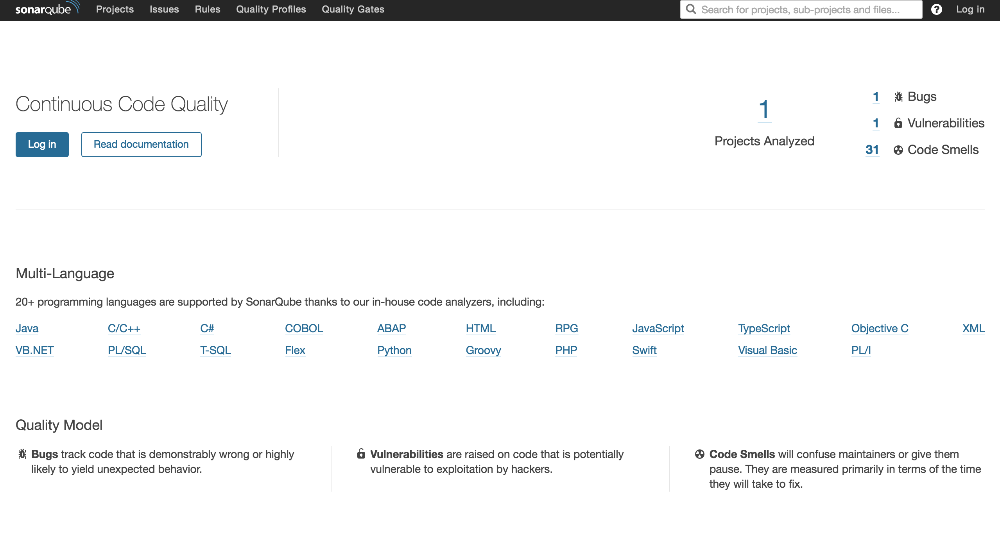

# 整合Maven

## 方法一：全局配置

* 在Maven的全局配置文件： `$MAVEN_PATH/conf/settings.xml` （也可能是`.m2/settings.xml` 看你是怎么配置Maven的）中添加如下内容：

  ```xml
  <profile>
    <id>sonar</id>
    <activation>
      <activeByDefault>true</activeByDefault>
    </activation>
    <properties>
      <sonar.jdbc.url>jdbc:mysql://localhost:3306/sonar?useUnicode=true</sonar.jdbc.url>
      <sonar.jdbc.driver>com.mysql.jdbc.Driver</sonar.jdbc.driver>
      <sonar.jdbc.username>root</sonar.jdbc.username>
      <sonar.jdbc.password>123456</sonar.jdbc.password>
      <sonar.host.url>http://127.0.0.1:9000</sonar.host.url>
    </properties>
  </profile>
  ```

* 到Maven项目的根目录执行如下命令，即可使用SonarQube分析项目：

  ```shell
  mvn sonar:sonar -Dsonar.java.binaries=target/sonar
  ```
  等待片刻后，项目构建成功：

  ```
  [INFO] Spring Cloud YES ................................... SUCCESS [ 34.395 s]
  [INFO] eureka-server ...................................... SKIPPED
  [INFO] config-server ...................................... SKIPPED
  [INFO] turbine-stream-server .............................. SKIPPED
  [INFO] zuul-server ........................................ SKIPPED
  [INFO] zipkin-server ...................................... SKIPPED
  [INFO] hystrix-dashboard .................................. SKIPPED
  [INFO] commons ............................................ SKIPPED
  [INFO] ms-content-sample .................................. SKIPPED
  [INFO] ms-consumer-sample ................................. SKIPPED
  [INFO] ------------------------------------------------------------------------
  [INFO] BUILD SUCCESS
  ```

* 此时，再次访问<http://localhost:9000> ，即可看到类似如下的界面：

  

  如右上角所示，此时可以看到SonarQube已经为我们分析了一个项目，该项目有1个Bug、1个漏洞、31个代码味道问题。点击进去即可看到详情，可以根据SonarQube给我们的提示进行修正、重构。


## 方法二：直接命令行控制

* 右上角头像 - My Account - Security页中，在`Generate New Token` 中填入你的Token名称，并点击`Generate` 按钮。

* 点击按钮后，将会看到生成的Token，例如`62b615f477557f98bc60b396c2b4ca2793afbdea` 

* 使用如下命令，即可使用Sonar分析项目。

  ```shell
  mvn sonar:sonar \
      -Dsonar.host.url=http://localhost:9000 \
      -Dsonar.login=62b615f477557f98bc60b396c2b4ca2793afbdea \
      -Dsonar.java.binaries=target/sonar
  ```
