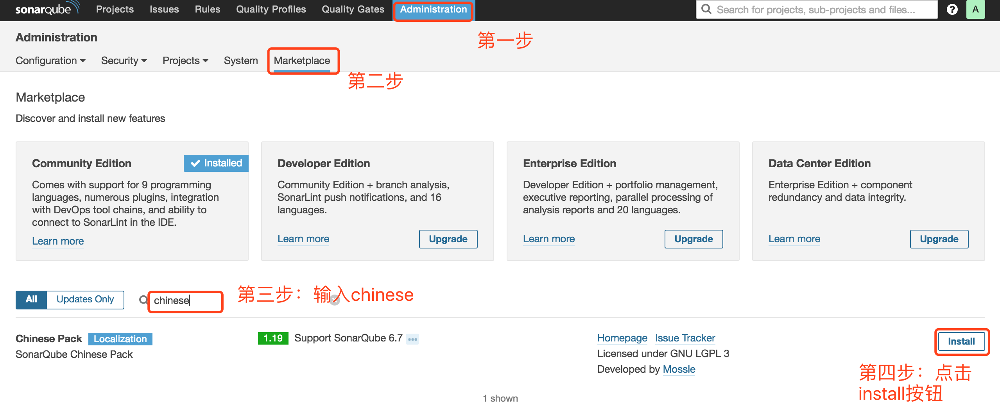
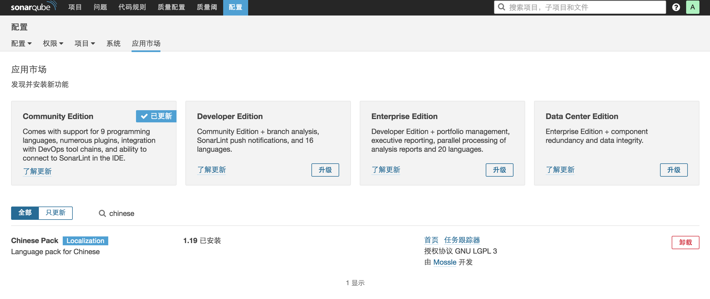

# 插件安装

本文演示如何为SonarQube安装插件。以安装汉化插件为例——

默认情况下，SonarQube是英文的，相信汉化是很多团队的硬需求。本篇我们来讲解如何汉化SonarQube。

* 按照图示进行操作：

  

* 点击 `Install` 按钮后，将会弹出来一个让你重启的提示，点击重启按钮。重启后，将会看到类似如下的界面

  

* 类似的方式，我们也可为SonarQube安装其他插件。